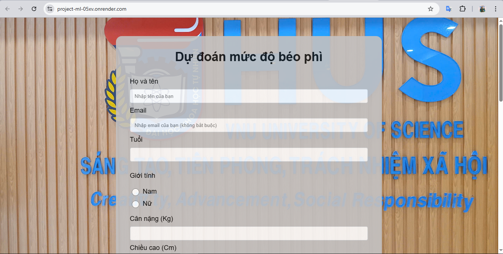

# Dự án: Thu thập và Dự đoán Mức độ Béo phì

Trang web cho phép người dùng nhập các thông tin cá nhân và thói quen sinh hoạt để dự đoán mức độ béo phì. Dự án được triển khai trên nền tảng Render.

[Link project](https://project-ml-05xv.onrender.com/)

## Mục lục

- [Giới thiệu](#giới-thiệu)
- [Tính năng](#tính-năng)
- [Ảnh chụp màn hình](#ảnh-chụp-màn-hình)
- [Công nghệ sử dụng](#công-nghệ-sử-dụng)
- [Cài đặt và Chạy cục bộ](#cài-đặt-và-chạy-cục-bộ)
- [Nguồn dữ liệu](#nguồn-dữ-liệu)


## Giới thiệu

Dự án này nhằm mục đích xây dựng một công cụ đơn giản giúp người dùng:
1.  Cung cấp thông tin về các yếu tố có thể ảnh hưởng đến cân nặng và tình trạng béo phì.
2.  Nhận được dự đoán về mức độ béo phì dựa trên thông tin đã cung cấp.
Ứng dụng được xây dựng dưới dạng một form trực tuyến và triển khai trên Render để dễ dàng truy cập.

## Tính năng

-   Giao diện form nhập liệu thân thiện.
-   Thu thập các thông tin cần thiết: tuổi, giới tính, chiều cao, cân nặng, thói quen ăn uống, hoạt động thể chất, v.v.
-   Sử dụng SVM trong Machine Learning để dự đoán mức độ béo phì.
-   Hiển thị kết quả dự đoán cho người dùng.
-   Dễ dàng triển khai và truy cập qua nền tảng Render.

## Ảnh chụp màn hình

**1. Giao diện Form Nhập Liệu:**

 

**2. Kết quả Dự đoán:**

 

## Công nghệ sử dụng

-   **Frontend:** HTML, CSS, JavaScript
-   **Backend:** Python
    -   Framework: Flask
-   **Thư viện Machine Learning:**
    -   Scikit-learn
    -   Pandas 
    -   NumPy 
-   **Deployment:** Render
-   **Quản lý Dependencies:** `requirements.txt`

## Cài đặt và Chạy cục bộ

Để chạy dự án này trên máy cục bộ của bạn:

1.  **Clone repository:**
    ```bash
    git clone https://github.com/TEN_CUA_BAN/TEN_PROJECT_CUA_BAN.git
    cd TEN_PROJECT_CUA_BAN
    ```

2.  **Tạo và kích hoạt môi trường ảo:**
    ```bash
    python -m venv venv
    # Trên Windows
    venv\Scripts\activate
    # Trên macOS/Linux
    source venv/bin/activate
    ```

3.  **Cài đặt các thư viện cần thiết:**
    ```bash
    pip install -r requirements.txt
    ```

## Nguồn dữ liệu

-   **Link:** [Link dữ liệu](https://archive.ics.uci.edu/dataset/544/estimation+of+obesity+levels+based+on+eating+habits+and+physical+condition?fbclid=IwY2xjawF6J71leHRuA2FlbQIxMAABHQ9DdyYYugLZqAKX823AaUEejEMVGZWxmlsLek-6sOi6W1-PDWLeE_30mA_aem_cIbbWQ8MKp0CpZzE22S_Tw)
